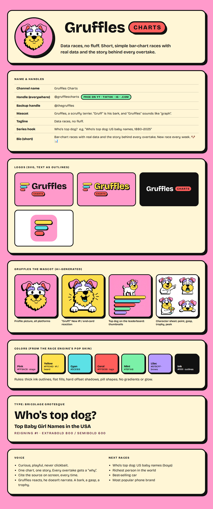

# Gruffles Charts: brand kit

Short, simple bar-chart races with real data and the story behind every
overtake. **Data races, no fluff.**



## Name and handles

- **Channel name:** Gruffles Charts
- **Handle:** `@grufflescharts` on YouTube, TikTok, Instagram and Facebook.
  On 2026-10-03 it was free on YouTube, TikTok and Instagram, and
  grufflescharts.com was unregistered. Facebook could not be checked
  automatically. Backup handle: `@thegruffles`.
- **Mascot:** Gruffles, a scruffy terrier. "Gruff" is his bark, and "Gruffles"
  sounds like "graph".
- **Tagline:** Data races, no fluff. **Series hook:** Who's top dog?

## Files

| Path | What |
|---|---|
| `logo/gruffles-charts-logo*.svg` | Stacked logo: race-bar mark + wordmark + CHARTS tag (ink, sticker yellow, sticker white) |
| `logo/gruffles-charts-inline*.svg` | One-line logo for banners, end cards and watermarks |
| `logo/gruffles-icon.svg` | Square icon / favicon |
| `logo/*.png` | Transparent PNG renders of the SVGs |
| `channel/avatar-800.png` | Profile picture for every platform |
| `channel/youtube-banner-2560x1440.png` | YouTube banner (content inside the 1546×423 safe area) |
| `ai/avatar.png`, `ai/bark.png`, `ai/race_scene.png`, `ai/mascot_poses.png` | Mascot art (Gemini `gemini-3-pro-image`) |
| `ai/explorations/` | First-round mascot drafts, kept for reference |
| `brand-sheet.html` / `.png` | One-page brand sheet |

## Style

Same as the race engine's pop skin (`bar-race/engine/race-topics.jsx`):
Bricolage Grotesque 800/600, thick `#111111` outlines, flat fills, hard
offset shadows, pill shapes. Colors: pink `#FF9ACB`, yellow `#FFE14D`, cyan
`#5CE1E6`, coral `#FF5E5B`, mint `#7BF1A8`, lilac `#B79CFF`.

Gruffles himself: white scruffy coat, yellow beard, lilac eyebrows, pink
floppy ears, black nose.

## Rebuilding

```sh
pip install fonttools brotli
python3 tools/build_logo.py                       # logo/*.svg (text as outlines)

# New mascot art, keeping the character consistent by passing the poses sheet as a reference:
python3 tools/gen_image.py gemini-3-pro-image ai/new.png "<prompt>" ai/mascot_poses.png

export PLAYWRIGHT_PATH=$(npm root -g)/playwright
node tools/render.mjs tools/banner.html channel/youtube-banner-2560x1440.png 2560 1440
```
